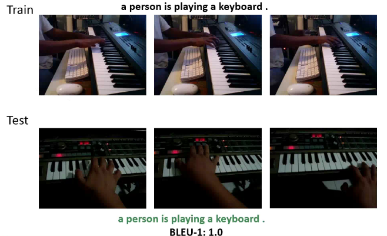

# Video Captioning
Automatically generating description for video content has been an important task in the field of Computer Vision. Since the input is a sequence of video frames, and the caption output is a sequence of words, sequence learning models that are wisely used in machine translation task can also be used for this task. This repo implements a sequence learning model (encoder-decoder) for video captioning using PyTorch framework. The encoder uses [VGG-16](https://arxiv.org/abs/1409.1556) model pretrained on the [ILSVRC-2012-CLS](http://www.image-net.org/challenges/LSVRC/2012/) dataset for extracting visual feature of video frames. Both the encoder and the decoder are Gated Recurrent Unit (GRU) networks.





#### Training time


#### Test time


## Usage


#### 1. Download the dataset

```bash
$ pip install -r requirements.txt
$
$
```

#### 2. Preprocessing

```bash
$ python
$ python
```

#### 3. Train the model

```bash
$ python train.py
```

#### 4. Test the model

```bash
$ python sample.py --image='png/example.png'
```

<br>

## Pretrained model
If you do not want to train the model from scratch, you can use a pretrained model.
